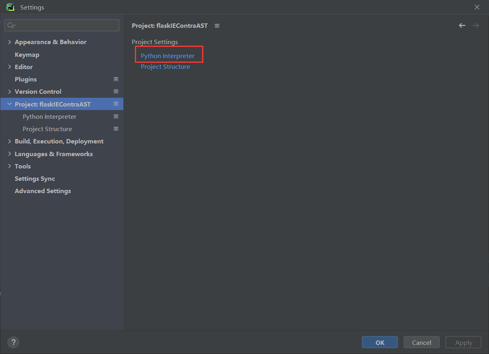
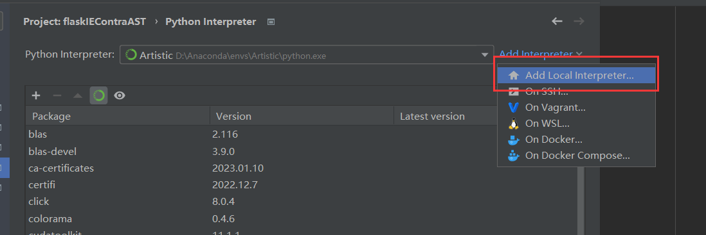
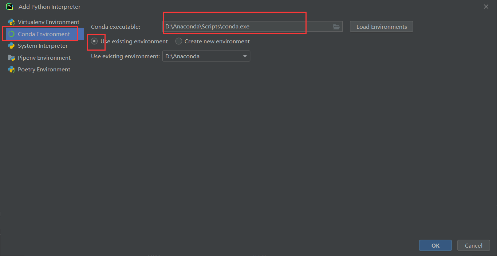
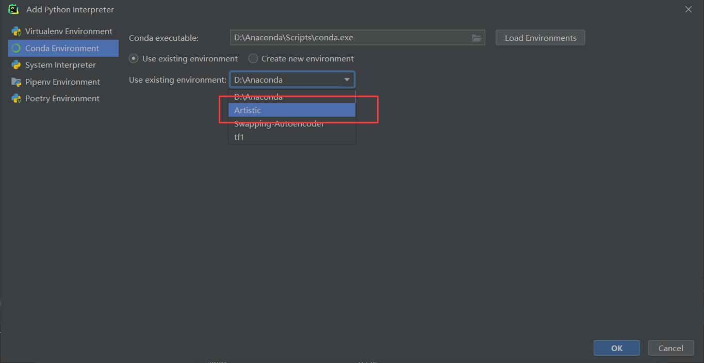
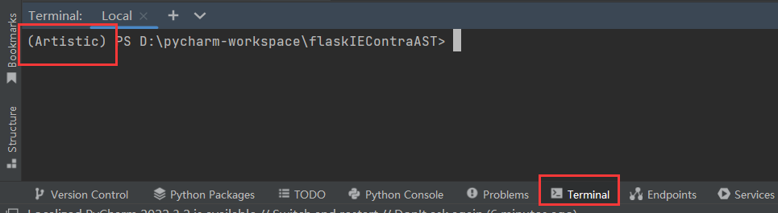

# 准备

- PyCharm **专业版**（用学校邮箱注册绑定就可以了）

- Anaconda 

  - 创建一个虚拟环境，要求如下，详见 https://github.com/tancik/StegaStamp#installation

    - Install tensorflow (tested with tf 1.13)

    - Python 3 required

    - Download dependencies（这一步在 git clone 之后再执行）

      ```
      pip install -r requirements.txt
      ```

      

- 建议提交代码时自己创一个分支，目前只有一个 develop 分支

- 模型文件貌似上传不上来，如果 git push 卡住可以先把模型文件删掉

- 如果上传图片，可以把图片放到 README.assets 文件夹下，注意描述路径时要用斜杠（ /），用反斜杠（\）会无法显示

# 开始

## PyCharm 设置

- git clone

- 使用 PyCharm 打开该文件夹（或者可以直接在 pycharm 里面 git clone，参考 https://blog.csdn.net/hxj0323/article/details/109208253 

- file -> settings -> Project，右边选择 Python Interpreter

  

- add interpreter ->  add local interpreter

  

- 左边选择 conda environment，右边选择自己 anaconda 安装目录下 Scripts 目录中 conda.exe 文件，下面选择 using existing environment

  

- 然后选择自己之前创建的虚拟环境（我这里是 Artistic）

  

- 最后依次点击 ok，apply，ok

- terminal 中出现虚拟环境的名字就设置成功了

  

- 有爆红的包就 pip install 即可


## 项目文件结构

```sh
├─/StageStamp
├─app.py
├─/static
├─/templates
└─config.py

```

- /StageStamp : 模型的依赖，见 https://github.com/tancik/StegaStamp

- app.py : Flask项目的入口

- /static : 存放静态资源，如图片、css文件等

- /templates : 存放模板文件（html）

- config.py : 一些配置文件

  

## app.py

- 视图函数和路由

  - 一个路由绑定一个视图函数，如：

    ```python
    @app.route('/')
    def hello_world():  # put application's code here
        return "hello!"
    
    ```

    表示访问跟路由时（127.0.0.1:5000/），会返回字符串 Hello

  - 带参数

    ```python
    @app.route('/encode/<path:filename>')
    def style(filename)
    ```

    这里的路由和视图函数中带了一个参数，表示文件名，可以在视图函数中调用，例如，访问 127.0.0.1:5000/encode/1.jpg 时，filename的值为 1.jpg

  - 多个参数

    若有多个参数，可以通过 request.args.get() 来获取

    ```python
    @app.route('/encode/<path:filename>')
    def encode(filename):
        msg = request.args.get("msg")
    ```

    此时有两个参数，一个为 filename， 另一个为 msg，例如访问  127.0.0.1:5000/encode/1.jpg?msg=test  时，filename为 1.jpg，msg为 test。项目里是通过**重定向**来访问的：

    ```python
    return redirect(url_for('encode', filename=filename, msg=m))
    ```

    

- 渲染模板

  - 模板指 html 文件

    ```python
    @app.route('/encode')
    def hello_world():  # put application's code here
        return render_template("encode_upload.html", form=form)
    
    ```

    上述代码表示在访问 127.0.0.1:5000/encode时，会渲染 encode_upload.html，即此时看到的是 encode_upload.html

  - 带参数

    ```python
    @app.route('/encode')
    def hello_world():  # put application's code here
        return render_template("encode_upload.html", form=form)
    ```

    上述代码在渲染 encode_upload.html 时带上了一个参数 form，其值为 form（两个 form 不一样，第一个 form 为参数名，第二个 form 为变量名）

    在 encode_upload.html 中通过双大括号可以使用 form，这里的 form 是一个表单对象

    ```html
    <body>
        <form action="" method="post" enctype="multipart/form-data">
            {{ form.csrf_token }}
            选择文件 {{ form.file }} <br>
            输入水印信息 {{ form.msg }}
            {{ form.submit }}
        </form>
    </body>
    ```

    

- url_for

  - 静态资源必须存放在 /static 文件夹下

  - 当需要调用资源时，使用 url_for() 来指定路径，格式为：

    ```python
    url_for("static", filename=...)
    ```

    filename= 后面接文件名（字符串）

  - 显示 /static 文件夹下的某张照片：

    ```html
    
    ```

  - 指定 CSS 文件：

    ```html
    <link rel="stylesheet" href="{{  url_for("static", filename=...) } }}">
    ```


# todo

- 水印这边
  - 需要的页面为：
    - 首页
    - 上传文件的页面（一个就可以了，然后可以选择是嵌入水印、提取水印还是识别水印）（目前是3个上传页面，项目还需要改一下）
    - 结果显示的页面（3个）
      - 嵌入水印结果：显示原图、嵌入后的图、嵌入的信息三张图片
      - 提取水印结果：显示嵌入水印后的图和嵌入的信息
      - 识别结果：一个下载按钮（video 标签不支持生成视频编码格式的显示）
  - ip 定位，嵌入信息为经纬度
- 目标检测
  - ？？
- 一个项目只能用一个虚拟环境，需要看一下两个模型的环境是不是冲突的，如果冲突的话只有弄成两个项目。但是 Flask 项目默认占用 5000 端口，弄成两个项目的话会冲突（但是好像可以改占用的端口）

